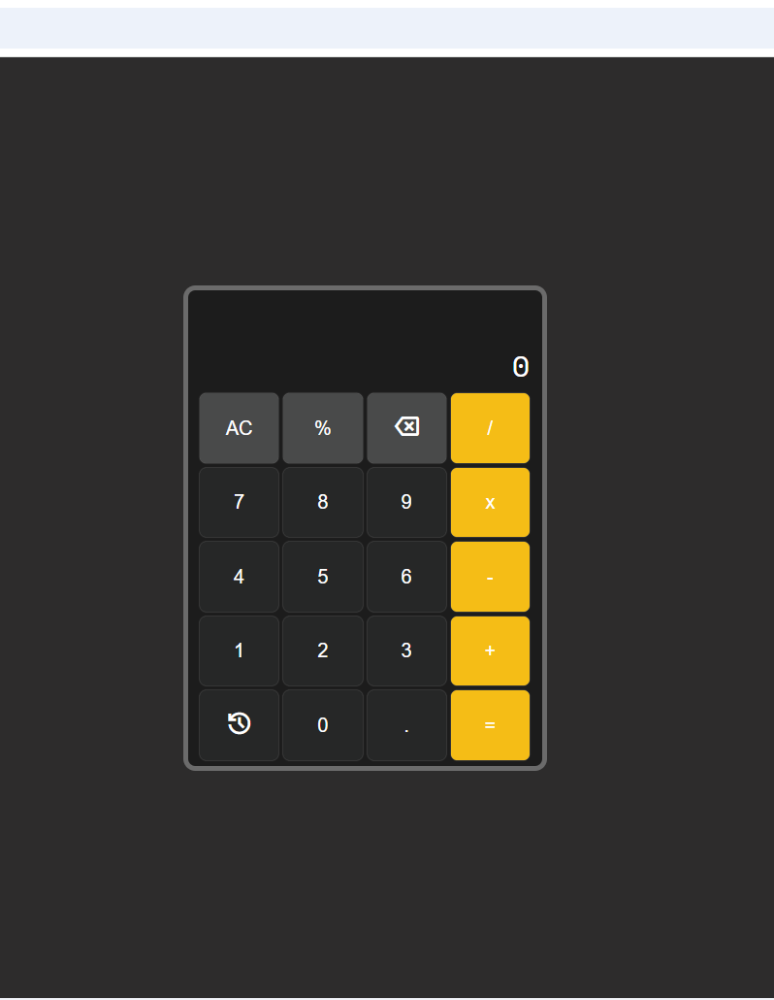

# SIMPLE KALKULATOR

## Deskripsi

Simple-Kalkulator adalah kalkulator berbasis web yang dibangun murni menggunakan **HTML, CSS, dan JavaScript** (tanpa framework/library eksternal). Proyek ini dibuat sebagai latihan pemahaman logika pemrograman, khususnya dalam menangani operasi aritmatika bertingkat sesuai aturan **urutan operasi matematika (PEMDAS)** — perkalian dan pembagian diproses lebih dulu sebelum penjumlahan dan pengurangan, meski ditulis dalam satu ekspresi panjang seperti `5+3x2`.

### Fitur

- Operasi dasar: tambah, kurang, kali, bagi, dan modulo (`%`)
- Mendukung banyak operator dalam satu ekspresi dengan urutan pengerjaan yang benar (PEMDAS)
- Input angka desimal
- Tombol backspace untuk menghapus input terakhir tanpa merusak ekspresi yang sedang ditulis
- Tombol clear (AC) untuk mengulang dari awal
- Validasi input dasar (mencegah operator ganda, ekspresi tidak lengkap, dll)
- Tampilan bertema gelap dengan font monospace (Space Mono)

### Teknologi

- HTML5
- CSS3 (custom properties / CSS variables)
- JavaScript (vanilla, tanpa library)